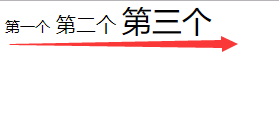

## css中的小技

1. `vertical-align`

 示例代码：

  ```html 
  <span>第一个</span>
  <span>第一个</span>
  <span>第一个</span>
<style>
    span:nth-child(1) {
        font-size: 12px;
    }
    span:nth-child(2) {
        font-size: 16px;
    }
    span:nth-child(3) {
        font-size: 24px;
    }
</style>
```

>默认这三个行内标签是按照基线，也就是文字最底部来对齐的

效果图：




>把第一个`<span>`样式加上`vertical-align：middle;`，三个span对齐方式依然是按照底部基线来对齐

示例代码：

  ```html 
  <span>第一个</span>
  <span>第一个</span>
  <span>第一个</span>
<style>
    span:nth-child(1) {
        font-size: 12px;
        vertical-align: middle;
    }
    span:nth-child(2) {
        font-size: 16px;
    }
    span:nth-child(3) {
        font-size: 24px;
    }
</style>
```
效果图：


>把第二个`<span>`样式也加上`vertical-align：middle;`，这时第一个与第二个是按照文字中心线来对齐的，但第三个span与第二个依然是按照底部基线对齐


示例代码：

  ```html 
  <span>第一个</span>
  <span>第一个</span>
  <span>第一个</span>
<style>
    span:nth-child(1) {
        font-size: 12px;
        vertical-align: middle;
    }
    span:nth-child(2) {
        font-size: 16px;
        vertical-align: middle;
    }
    span:nth-child(3) {
        font-size: 24px;
    }
</style>
```
效果图：


>把第三个`<span>`样式也加上`vertical-align：middle;`，这时三个span标签是按照文字中心线居中对齐的


示例代码：

  ```html 
  <span>第一个</span>
  <span>第一个</span>
  <span>第一个</span>
<style>
    span:nth-child(1) {
        font-size: 12px;
        vertical-align: middle;
    }
    span:nth-child(2) {
        font-size: 16px;
        vertical-align: middle;
    }
    span:nth-child(3) {
        font-size: 24px;
        vertical-align: middle;
    }
</style>
```
效果图：


>vertical-align是有底部基线的，那么我们就可以设置距离基线的位置， 这个小技巧用来调一些小的图标居中很实用

```css
span:nth-child(1) {
    vertical-align: 2px; /* 距离底部基线向上2px */
    vertical-align: -2px; /* 距离底部基线向下2px */
}
```

>另外我们经常遇到些图文混排时发现底部有一点边距，这是由于文字是按照底部基线对齐、而图片按照顶部对齐，这时我们只要把图片也设置为底部对齐就可以去除缝隙了

示例代码：

```html
    <div style="background: red;">
        <span>第一个</span>
        
    </div>
```

效果图：


这时我们只需要把img标签的vertical-align样式设置为底部对齐就能完美解决底部缝隙问题了。

示例代码：

```html
    <div style="background: red;">
        <span>第一个</span>
        
    </div>
```

效果图：


好了，解决

如有不对，还请各位斧正。


