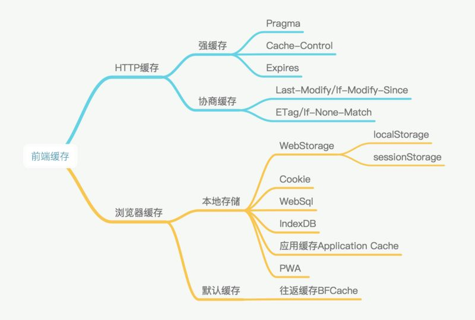
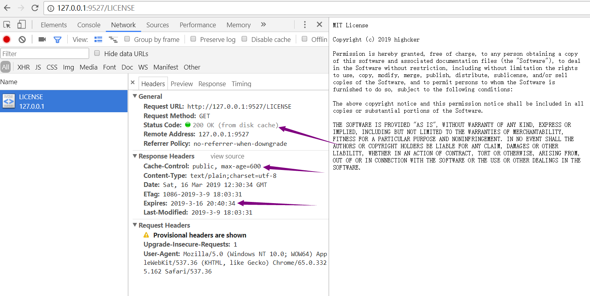
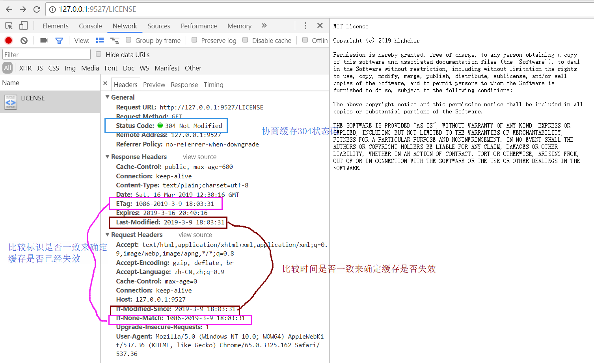

# HTTP

## 缓存

>缓存分类

主要分为http缓存和浏览器缓存

### 1. http缓存

http缓存分为强缓存和协商缓存

|        |强缓存  |协商缓存|
|:------:|:------:|:------:|
|http状态码|200|304|
|缓存位置|本地浏览器|本地浏览器|
|谁来决定|浏览器|服务器|
|刷新|F5刷新无效，ctrl+F5刷新无效|F5刷新有效，ctrl+F5刷新无效|

#### 1.1 强缓存

|        |值     |优先级   |优缺点   |
|:------:|:------|:------:|:------:|
|Pragma|no-cache不直接使用缓存，需服务器校验|中|已废弃|
|Cache-Control|max-age:xx秒，相对时间 no-cache:不直接使用缓存，每次都要服务器校验 no-store:不使用缓存，每次都取最新的 public/private:是否只能被单个用户保存|高|强制缓存|
|Expires|GIT时间|低|服务器上设置的时间和本地时间不一定统一|

>http响应状态码为200 信息为from disk cache或者200 from memory cache

#### 1.2 协商缓存

>协商缓存一般成对出现

||值|优先级|优缺点|
|:------:|:------:|:------:|:------|
|If-Modified-Since/Last-Modifyed|GIT时间|中|1.修改并不意味着改变 2.秒级判断|
|If-None-Match/ETag|校验值|高|暂未发现|

效果图：

>最佳优化策略:因为协商缓存本身也存在http请求损耗，所以最佳优化策略尽可能利用强缓存，将静态文件存储较长时间，消灭304

但是给文件设置一个很长的缓存时间也会带来其他问题，用户不能及时更新新的静态文件，解决办法通过每次更新不同的静态资源文件名来消除强缓存带来的问题

